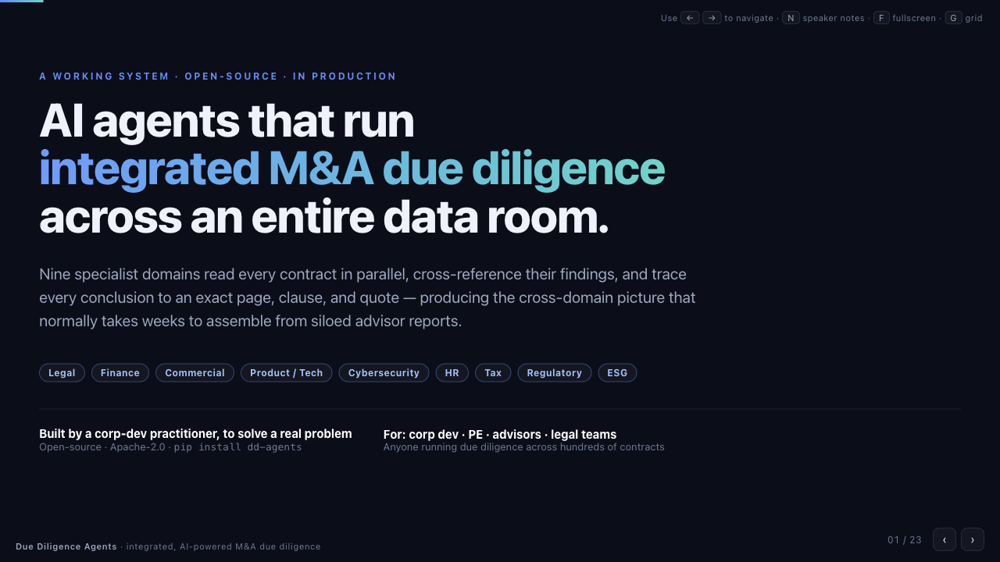

<p align="center">
  
</p>
<p align="center">
  <h1 align="center">Due Diligence Agents</h1>
  <p align="center">
    Find what gets buried in the data room. Open-source integrated M&A due diligence — 9 specialist domains across every contract, cross-referenced with exact citations.
  </p>
  <p align="center">
    <a href="https://pypi.org/project/dd-agents/"></a>
    <a href="https://pypi.org/project/dd-agents/"></a>
    <a href="https://github.com/zoharbabin/due-diligence-agents/actions"></a>
    <a href="https://www.python.org/downloads/"></a>
    <a href="LICENSE"></a>
    <a href="https://github.com/zoharbabin/due-diligence-agents/actions"></a>
    
    <a href="https://hub.docker.com/r/zoharbabin/due-diligence-agents"></a>
    <a href="https://github.com/codespaces/new?hide_repo_select=true&repo=zoharbabin/due-diligence-agents"></a>
    <a href="https://github.com/zoharbabin/due-diligence-agents/stargazers"></a>
  </p>
</p>

---

**[See a sample report](https://zoharbabin.github.io/due-diligence-agents/sample-report/)** — interactive HTML output from a synthetic deal, no install required.

### 📑 Walkthrough deck

<p align="center">
<a href="https://zoharbabin.github.io/due-diligence-agents/marketing/presentation.html">

</a>
</p>
<p align="center">
<a href="https://zoharbabin.github.io/due-diligence-agents/marketing/presentation.html"><strong>▶ Open the interactive walkthrough →</strong></a> · 23 slides · architecture, cross-domain synthesis, trust layer, and ROI · use <kbd>←</kbd>/<kbd>→</kbd> to navigate, <kbd>N</kbd> for speaker notes
</p>

---

<details>
<summary><strong>CLI Inteface Walkthrough Recording</strong></summary>
  
https://github.com/user-attachments/assets/03ae7e38-8280-488c-898a-61c1a361bb7d

</details>

---

Finds what gets buried across hundreds of contracts — cross-references it across 9 specialist domains (Legal, Finance, Commercial, ProductTech, Cybersecurity, HR, Tax, Regulatory, ESG) — and traces every finding to an exact page, section, and quote. Use the structured output alongside your advisors to build IC memos, advisor reports, negotiation checklists, or integration plans.

> **This tool does not replace professional advisors.** Legal, financial, and regulatory conclusions should always be made by qualified professionals. This tool helps your team and advisors work faster.

## Why This Exists

I built this to solve my own problem. As a corp dev lead, I'd spend weeks assembling the cross-domain picture from siloed advisor reports — legal, financial, and commercial teams all flagging the same subject independently, with nobody connecting the dots. A termination clause in one contract and a revenue concentration risk in the same subject would be flagged in separate workstreams, if at all.

The numbers tell the story:

- **31% of M&A failures trace back to due diligence shortcomings** — [Acquisition Stars](https://acquisitionstars.com/ma-failure-rate/), citing HBR, McKinsey, and KPMG research
- **DD timelines keep compressing** — what used to be a six-week process becomes three weeks, with no reduction in scope — [Spellbook](https://www.spellbook.legal/briefs/m-a-due-diligence)
- **Corp dev teams screen 200-1,000+ companies/year** but close only 1-10 — a 1-3% conversion rate, with DD costs sunk on every deal that doesn't close — [CorpDev.AI](https://www.corpdev.ai/wiki/fundamentals/corpdev-metrics)
- **AI contract analysis reaches 95% accuracy** with clause-aware prompting (up from 74% baseline) — [Addleshaw Goddard RAG Report](https://www.addleshawgoddard.com/globalassets/insights/technology/llm/rag-report.pdf), 510 contracts tested
- **86% of M&A organizations have integrated GenAI** into deal workflows — [Deloitte 2025 M&A Trends](https://www.deloitte.com/us/en/what-we-do/capabilities/mergers-acquisitions-restructuring/articles/m-a-trends-report.html)

This tool runs all nine workstreams in parallel across every document, cross-references findings automatically, and produces structured analysis your team can search, filter, and drill into — the kind of cross-domain picture that used to take weeks to assemble manually.

**Who uses this:** Corp dev teams screening targets, PE firms running portfolio DD, legal teams doing contract review, advisors accelerating workstreams. Anyone who needs to search hundreds of contracts and connect findings across domains.

## What You Can Do

### Full Pipeline — Integrated Due Diligence

```bash
dd-agents run deal-config.json
```

Analyzes every document through 9 domain lenses, cross-references findings, and validates quality through 5 blocking gates. Produces:

- **Interactive HTML report** — Go/No-Go verdict with executive narrative, progressive disclosure (decision → actions → domain details → full evidence), severity filtering
- **14-sheet Excel report** — structured findings, cross-references, audit trail for downstream modeling
- **Per-subject JSON findings** — every finding with severity, citations, cross-references, and governance graph edges

### Quick Scan — Red Flag Triage in Minutes

```bash
dd-agents run deal-config.json --quick-scan --model-profile economy
```

GREEN / YELLOW / RED signal across 8 deal-killer categories. Get a first read before committing to full analysis.

### Contract Search — Targeted Questions, No Full Pipeline

```bash
dd-agents search prompts.json --data-room ./data_room
```

Ask specific questions across every contract and get an Excel report with answers, citations, and verification scores. The prompts file is plain JSON any legal professional can write:

```json
{
  "name": "Change of Control Analysis",
  "columns": [
    {
      "name": "Consent Required",
      "prompt": "Does this agreement require consent upon a change of control? Answer YES, NO, or NOT_ADDRESSED."
    }
  ]
}
```

See [`examples/search/`](examples/search/) for ready-to-use templates.

### Post-Run Tools

```bash
dd-agents chat --report _dd/forensic-dd/runs/latest         # Interactive multi-turn chat with memory
dd-agents query --report _dd/forensic-dd/runs/latest        # Ask questions about findings
dd-agents assess ./data_room                                # Check data room quality
dd-agents portfolio add "Deal A" --data-room ./data_room_a  # Track multiple deals
dd-agents portfolio compare                                 # Compare risk across deals
dd-agents export-pdf report.html                            # Export to PDF
dd-agents log --data-room ./data_room                       # Browse the deal knowledge timeline
dd-agents lineage --data-room ./data_room                   # Trace finding evolution across runs
dd-agents health --data-room ./data_room                    # Check knowledge base integrity
dd-agents annotate --data-room ./data_room "Confirmed with counsel"  # Add analyst notes
```

### Customize the Agents (no code required)

Inspect, audit, and tailor each specialist's persona, focus areas, and severity
calibration — by editing markdown, not Python. Safety rules can never be removed.

```bash
dd-agents agents list                          # See every specialist and its status
dd-agents agents describe --agent legal        # Read an agent's persona + safety floor
dd-agents agents validate ./my-project         # Lint your dd-config/ customizations
dd-agents agents preview --agent legal --project-dir ./my-project  # Exact assembled prompt
```

Drop a `dd-config/agents/legal.md` next to your deal config to override personas,
add focus areas, or adjust severity — optionally inheriting a bundled deal-type
profile (`saas`, `regulated-fintech`, …). See
[Agent Customization](docs/agent-customization.md).

## Quick Start

**Prerequisites:** Python 3.12+ and an [Anthropic API key](https://console.anthropic.com/).

```bash
# 1. Install
pip install 'dd-agents[pdf]'

# 2. Set your API key
export ANTHROPIC_API_KEY="sk-ant-..."

# 3. Generate a deal config (AI scans the data room and infers entity aliases, focus areas)
dd-agents auto-config "Buyer Corp" "Target Inc" --data-room ./data_room

# 4. Run the analysis
dd-agents run deal-config.json
```

<details>
<summary><strong>Install from source (development)</strong></summary>

```bash
git clone https://github.com/zoharbabin/due-diligence-agents.git
cd due-diligence-agents
pip install -e ".[dev,pdf]"
```
</details>

Output appears at `{data_room_path}/_dd/forensic-dd/runs/latest/report/dd_report.html` — open it in your browser.

**No API key yet?** Generate a config without any API calls: `dd-agents init --data-room ./data_room`

<details>
<summary><strong>Minimal config (only required fields)</strong></summary>

```json
{
  "config_version": "1.0.0",
  "buyer": { "name": "Acme Corp" },
  "target": { "name": "Target Inc" },
  "deal": { "type": "acquisition", "focus_areas": ["change_of_control", "ip_ownership"] },
  "data_room": { "path": "./data_room" }
}
```

`deal.focus_areas` must list at least one area. Everything else (`entity_aliases`, `judge`, `execution`, `buyer_strategy`, etc.) is optional and enhances analysis when provided. See [Deal Configuration](docs/user-guide/deal-configuration.md) for the full schema.
</details>

See the [Getting Started guide](docs/user-guide/getting-started.md) for a complete walkthrough with the included sample data room.

<details>
<summary><strong>API Key Options</strong></summary>

**Environment variable** (temporary):
```bash
export ANTHROPIC_API_KEY="sk-ant-..."
```

**`.env` file** (persistent, recommended):
```bash
cp .env.example .env
# Edit .env and add your key
```

**AWS Bedrock** (if you use AWS):
```bash
export AWS_PROFILE=default
export AWS_REGION=us-east-1
```
</details>

<details>
<summary><strong>Preparing Your Data Room</strong></summary>

Organize contracts into folders by subject or counterparty:

```
data_room/
  SubjectGroup_A/
    Acme_Corp/
      master_agreement.pdf
      amendment_2024.pdf
    Beta_Inc/
      license_agreement.pdf
  SubjectGroup_B/
    Gamma_LLC/
      services_contract.docx
  _reference/                    # Optional: buyer overview, customer database, etc.
    buyer_overview.pdf
```

Supports PDFs, Word, Excel, PowerPoint, and images. Scanned PDFs are handled via OCR.
</details>

## How It Works

```
  Data Room (PDFs, Word, Excel, Images)
       │
       ▼
  ┌─────────────────────────────────────┐
  │        Python Orchestrator          │
  │         38-step pipeline            │
  │       5 blocking quality gates      │
  └──────────────┬──────────────────────┘
                 │
    ┌────────────┼────────────┐
    │            │            │
    ▼            ▼            ▼
 ┌──────┐  ┌────────┐  ┌──────────┐  ┌──────────┐  ┌─────────────┐
 │Legal │  │Finance │  │Commercial│  │ProductTech│ │Cybersecurity│
 │Agent │  │ Agent  │  │  Agent   │  │  Agent   │  │   Agent     │
 └──┬───┘  └───┬────┘  └────┬─────┘  └────┬─────┘  └──────┬──────┘
    │          │            │             │               │
 ┌──┴──┐  ┌────────┐  ┌─────┴──────┐  ┌───┴──┐    ┌───────┴─────┐
 │ HR  │  │  Tax   │  │ Regulatory │  │ ESG  │    │  + External │
 │Agent│  │ Agent  │  │   Agent    │  │Agent │    │   Agents    │
 └──┬──┘  └───┬────┘  └──────┬─────┘  └───┬──┘    └───────┬─────┘
    │         │              │            │               │
    └─────────┴───────┬──────┴────────────┴───────────────┘
                      │
              ┌───────▼────────┐
              │  Cross-Domain  │  ← Symbolic trigger rules detect
              │   Analysis     │    inter-domain dependencies
              └───────┬────────┘
                      │
              ┌───────▼────────┐
              │  Judge Agent   │  ← Validates findings
              │  (optional)    │
              └───────┬────────┘
                      │
              ┌───────▼────────┐
              │  Merge & Audit │  ← Dedup, numerical checks,
              │  31 QA checks  │    citation verification
              └───────┬────────┘
                      │
              ┌───────▼────────┐
              │   Executive    │  ← Severity calibration,
              │   Synthesis    │    Go/No-Go signal
              └───────┬────────┘
                      │
                      ▼
            HTML + Excel + JSON
```

**9 domain specialists** (Legal, Finance, Commercial, ProductTech, Cybersecurity, HR, Tax, Regulatory, ESG) analyze every document in parallel. Agents are config-driven — enable/disable per deal via `deal-config.json`. A **Judge** spot-checks findings. **Executive Synthesis** calibrates severity and the Go/No-Go signal. **Red Flag Scanner** provides quick triage. **Acquirer Intelligence** maps findings to the buyer's thesis (when configured). External agents can be added via pip entry-points without modifying core code.

The pipeline **halts on quality failures** rather than producing unreliable output. Runs can be resumed from any step.

## Security & Privacy

- **Local execution** — all analysis runs on your machine. Documents only leave your machine as API calls to your configured LLM provider (Anthropic or AWS Bedrock).
- **No telemetry** — the tool does not phone home, collect usage data, or send analytics anywhere.
- **Read-only** — the tool never modifies files in your data room. Output is written to a separate `_dd/` directory.
- **No persistent credentials** — API keys are read from environment variables or `.env` files, never stored in output artifacts.

See [SECURITY.md](SECURITY.md) for the full security policy, vulnerability reporting, and data handling details.

## What Gets Analyzed

| Domain | Focus Areas |
|-------|-------------|
| **Legal** | Change of control (5 subtypes), anti-assignment, termination clauses, IP ownership, IP portfolio strength, freedom to operate, data privacy, indemnification, liability caps, warranty, dispute resolution, governance graph construction |
| **Finance** | Revenue cross-referencing (flags >5% ARR mismatch), revenue decomposition, unit economics (CAC/LTV/NRR/GRR), pricing compliance, cost structure, financial projections, insurance program analysis |
| **Commercial** | Renewal mechanics, churn risk, SLA commitments, volume commitments, customer segmentation (flags >30% concentration), pricing models, MFN clauses, competitive positioning, supply chain risk, operational capacity |
| **ProductTech** | DPA analysis, security certifications (SOC2/ISO27001), technical SLAs, integration requirements, data portability, migration complexity, technical debt, vendor lock-in |
| **Cybersecurity** | Security governance, incident history, vulnerability management, identity & access, network infrastructure, data protection, third-party risk, disaster recovery, compliance certifications, cyber insurance |
| **HR** | Workforce composition, compensation analysis, benefits liabilities, key talent retention, organizational structure, labor compliance, union/collective bargaining, culture integration, succession planning, workforce classification |
| **Tax** | Income tax compliance, transfer pricing, NOL/tax attributes, sales & use tax, international tax, deal structure tax, tax provisions, tax controversy, employee tax, indirect tax |
| **Regulatory** | License transferability, antitrust/competition, data privacy regulation, financial regulation, healthcare regulation, AML/sanctions, government contracts, environmental regulation, consumer protection |
| **ESG** | Environmental contamination, environmental permits, climate/carbon risk, hazardous materials, supply chain sustainability, ESG governance, social impact, ESG disclosure, biodiversity/land use, circular economy |

## Pipeline Output

```
_dd/forensic-dd/
  index/text/                     # Extracted document text (cached across runs)
  inventory/                      # File discovery and company registry
  runs/
    latest/                       # Always points to the most recent run
      findings/
        legal/                    # Per-subject findings from each agent
        finance/
        commercial/
        producttech/
        merged/                   # Deduplicated cross-domain findings
      report/
        dd_report.html            # Interactive HTML report
        dd_report.xlsx            # 14-sheet Excel report
      audit.json                  # 31 quality validation checks
      numerical_manifest.json     # Every financial figure traced to source
      metadata.json               # Run metadata and API costs
  knowledge/                      # Deal Knowledge Base (compounds across runs)
    articles/                     # Structured knowledge articles
    chronicle.jsonl               # Append-only timeline of all events
    graph.json                    # Cross-reference knowledge graph
  entity_resolution_cache.json    # Company name matching (reused across runs)
```

## Installation

```bash
pip install 'dd-agents[pdf]'      # Recommended (includes PDF extraction via pymupdf)
```

<details>
<summary><strong>Alternative install methods</strong></summary>

```bash
# macOS (Homebrew)
brew install zoharbabin/due-diligence-agents/dd-agents

# Docker
docker pull zoharbabin/due-diligence-agents:latest

# Extras
pip install dd-agents           # Core only (no PDF extraction)
pip install 'dd-agents[vector]'   # + semantic search via ChromaDB
pip install 'dd-agents[ocr]'      # + OCR for scanned documents (English)
pip install 'dd-agents[glm-ocr]'  # + multilingual OCR (100+ languages, Apple Silicon)
```
</details>

<details>
<summary><strong>Optional System Dependencies</strong></summary>

| Dependency | macOS | Linux | Purpose |
|-----------|-------|-------|---------|
| `poppler` | `brew install poppler` | `apt install poppler-utils` | Fallback PDF extraction |
| `tesseract` | `brew install tesseract` | `apt install tesseract-ocr` | OCR for scanned PDFs |

These are optional — the tool works without them but may produce lower-quality text from some scanned documents.
</details>

<details>
<summary><strong>Docker</strong></summary>

```bash
# Pre-built image (recommended)
docker pull zoharbabin/due-diligence-agents:latest
docker run -e ANTHROPIC_API_KEY="sk-ant-..." \
  -v ./data_room:/workspace/data_room \
  -v ./deal-config.json:/workspace/deal-config.json \
  zoharbabin/due-diligence-agents run deal-config.json

# Or build from source
docker build -t dd-agents .
docker run -e ANTHROPIC_API_KEY="sk-ant-..." \
  -v ./data_room:/workspace/data_room \
  -v ./deal-config.json:/workspace/deal-config.json \
  dd-agents run deal-config.json
```
</details>

### Licensing

All core dependencies use permissive open-source licenses (Apache 2.0, MIT, BSD). The optional `[pdf]` extra installs pymupdf, which is AGPL-3.0 licensed — if you redistribute software that bundles pymupdf, AGPL copyleft terms apply to your distribution. Using it internally or as a tool does not trigger copyleft.

## Documentation

| Guide | Description |
|-------|-------------|
| [Getting Started](docs/user-guide/getting-started.md) | Installation, first run with sample data room |
| [Deal Configuration](docs/user-guide/deal-configuration.md) | Config file structure, auto-generation |
| [Running the Pipeline](docs/user-guide/running-pipeline.md) | Execution modes, resume, quality gates |
| [Reading the Report](docs/user-guide/reading-report.md) | Navigating the HTML and Excel output |
| [CLI Reference](docs/user-guide/cli-reference.md) | Complete command reference |
| [Troubleshooting](docs/user-guide/troubleshooting.md) | Common errors, exit codes, recovery steps |
| [Search Guide](docs/search-guide.md) | Contract search for legal teams |
| [Agent Customization](docs/agent-customization.md) | Tailor agent personas, focus areas, and severity (no code) |

## Contributing

See [CONTRIBUTING.md](CONTRIBUTING.md) for development setup, code style, and PR process.

## Press & Coverage

| Source | Article |
|--------|---------|
| C&S Finance Group | [New Open-Source AI System with 13 Agents Launched to Automate M&A Due Diligence](https://www.csfinancegroup.com/news/new-open-source-ai-system-with-13-agents-launched-to-automate-m-a-due-diligence-27eaa0b3-23d1-4926-ba9e-b1cd051317ce) |
| DEV Community | [Building a 13-Agent AI System for M&A Due Diligence — Architecture Deep Dive](https://dev.to/zoharbabin/building-a-13-agent-ai-system-for-ma-due-diligence-architecture-deep-dive-20ah) |

## Star History

If this project is useful to you, consider giving it a star — it helps others discover it.

[](https://star-history.com/#zoharbabin/due-diligence-agents&Date)

## License

Apache 2.0. See [LICENSE](LICENSE).
