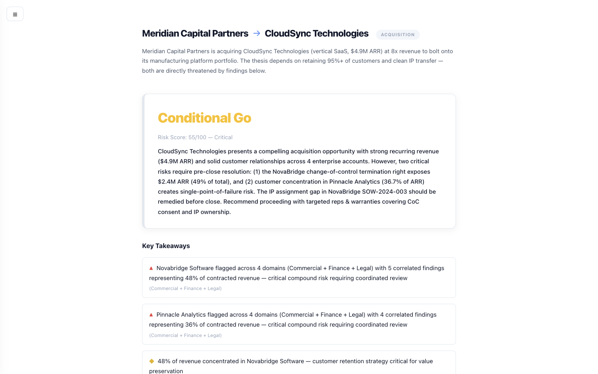
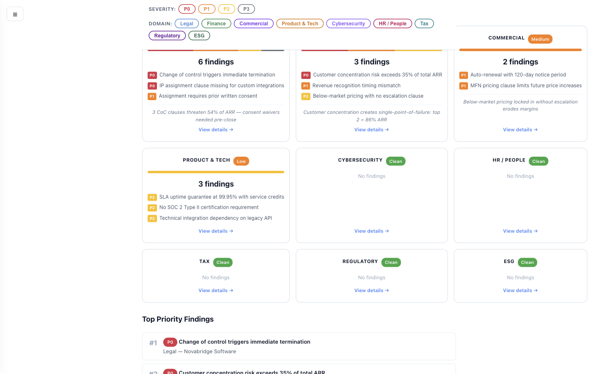
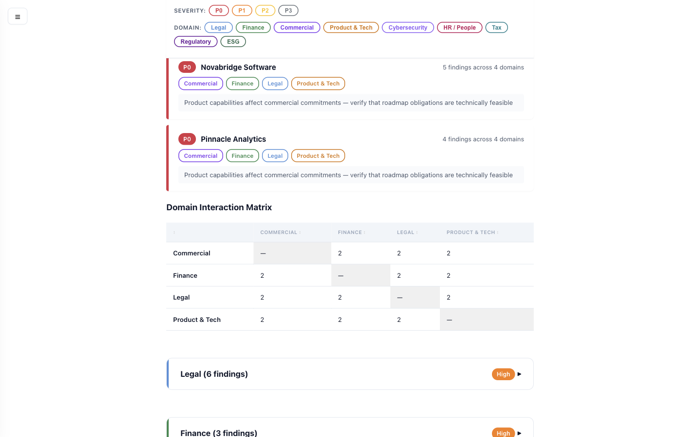
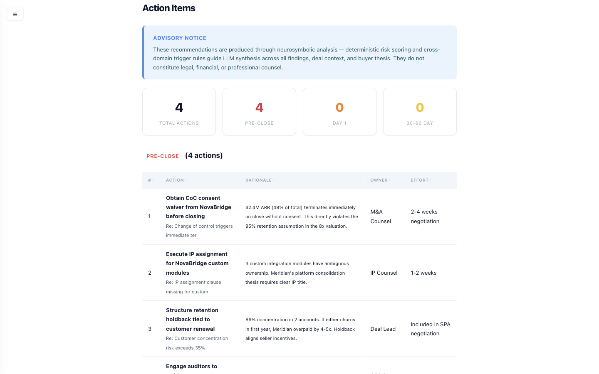
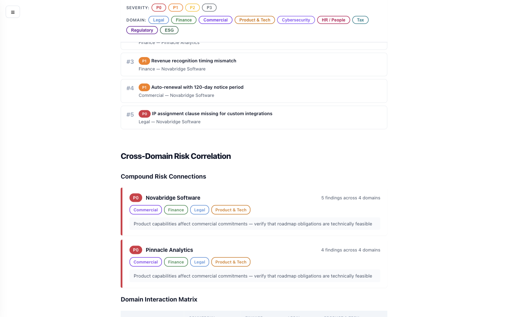
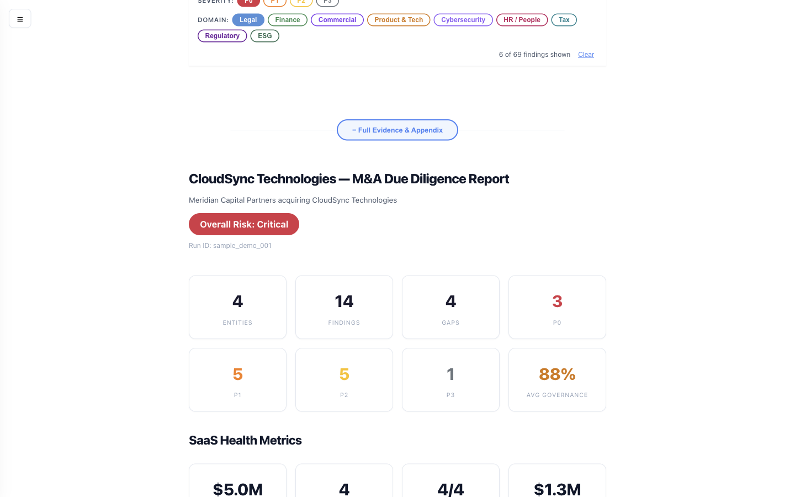
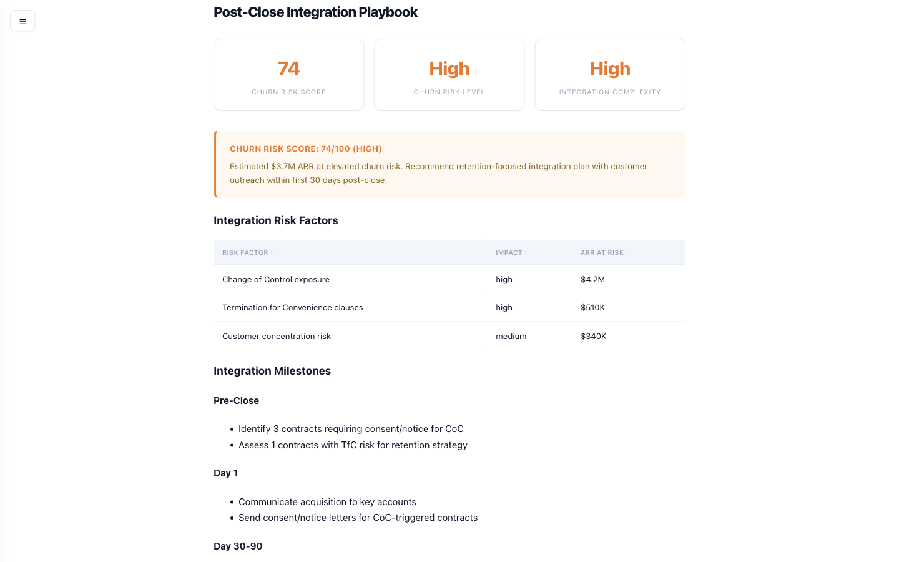
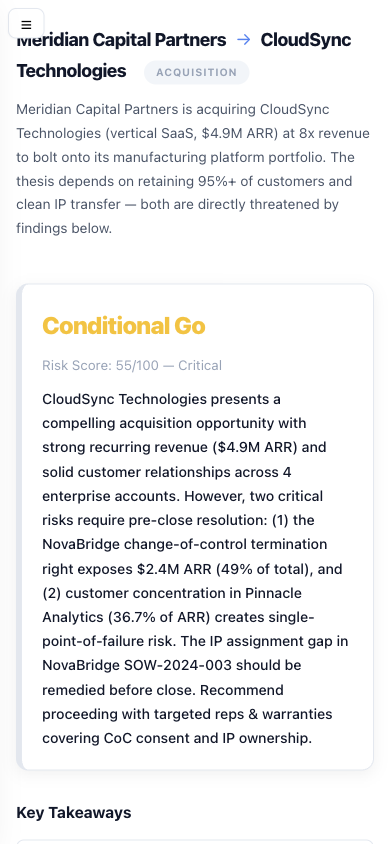

# DD-Agents Report Showcase

The HTML report transforms raw contract analysis into a **decision support tool** — principals get their answer in 30 seconds, not 30 minutes of scrolling.

---

## Executive Verdict (Layer 1 — visible on load)

The report opens with a **Go/No-Go verdict** backed by executive narrative, key takeaways as full sentences, and a 9-domain risk strip — everything a deal lead needs without scrolling.



**What you see:**
- Deal context header (buyer → target, deal type, date)
- **Go / Conditional Go / Proceed with Caution / No-Go** verdict with integrated executive narrative explaining WHY
- Key takeaways connecting insights across domains as severity-tagged sentences
- Domain risk strip showing all 9 specialist domains with severity bars
- Open items panel (needs data, needs counsel, cost TBD)

---

## Domain Overview Cards

Nine specialist domains at a glance — risk badge, severity bar distribution, top findings preview with severity tags.



**What you see:**
- Left-border accent colored by risk level (High/Medium/Low/Clean)
- Severity bar showing P0/P1/P2/P3 distribution
- Top 3 findings preview with colored severity tag pills
- LLM-generated narrative headline (when narrative data available)
- Click any card to expand full domain analysis

---

## Cross-Domain Synthesis

The most powerful differentiator: **automatic detection of risks that span multiple domains**. A CoC clause (Legal) affecting revenue concentration (Finance) with retention implications (HR) — connected automatically via neurosymbolic trigger rules.



**What you see:**
- Entity-level compound risk cards with domain badges
- Connection narrative explaining WHY the correlation matters
- Domain Interaction Matrix showing which domains have correlated findings
- Compound severity escalation (2xP2 → P1, P1+P2 across domains → P0)

---

## Actionable Recommendations

Neurosymbolic analysis — deterministic risk scoring and cross-domain trigger rules guide LLM synthesis to produce context-aware recommendations with owner, timeline, effort, and escalation path.



**What you see:**
- Grouped by timeline: Pre-close → Post-close 30d → 90d → Long-term
- Each action tied to a specific finding with severity badge
- Owner assignment (Legal Counsel, M&A Counsel, Deal Team, etc.)
- Effort estimation and escalation guidance
- Advisory disclaimer (not legal counsel)

---

## Deal Breakers & Key Risks

Critical findings highlighted with full context — the "wolf pack" that could kill the deal.



**What you see:**
- P0 deal-stoppers with full description and source citation
- Key Risks table with category, priority, and risk summary
- P0/P1 detail tables with entity, finding, and financial impact

---

## Progressive Disclosure (4 Layers)

The report uses progressive disclosure — you see the answer first, then drill down:

| Layer | Content | Default State |
|-------|---------|---------------|
| **1: Decision** | Verdict, takeaways, domain strip, open items | Visible on load |
| **2: Actions** | Recommendations, financial impact, valuation bridge | Click to expand |
| **3: Domains** | Domain cards, cross-domain correlation, deep-dives | Click to expand |
| **4: Evidence** | All findings, specialized analyses, appendix | Click to expand |

Clicking a sidebar link automatically expands the parent layer and scrolls to the target section.

---

## Client-Side Filter Bar

Filter findings by severity and domain **instantly** — no page reload, no server calls. Share filtered views via URL hash.



**What you see:**
- Sticky severity chips (P0/P1/P2/P3) with active state highlighting
- Domain chips matching the deal's active domains
- Live counter: "5 of 41 findings shown"
- Clear link to reset all filters
- URL updates to `#filter:sev=P0` — shareable with colleagues

---

## Integration Playbook

Post-close integration roadmap generated from the findings — milestones, churn risk metrics, and timeline phases.



**What you see:**
- Churn Risk Score and Integration Complexity ratings
- Pre-Close → Day 1 → Day 30-90 → Day 90-180 milestones
- Each milestone tied to specific findings and recommendations
- Documentation gaps flagged with priority

---

## Mobile Responsive

Full report functionality on mobile — filter bar wraps, sidebar collapses, cards stack vertically.



---

## Technical Highlights

| Feature | Implementation |
|---------|---------------|
| **Self-contained** | Single HTML file, no external dependencies |
| **Neurosymbolic verdicts** | Deterministic risk scoring guides LLM synthesis for contextual Go/No-Go |
| **Progressive disclosure** | 4 layers — answer first, detail on demand |
| **WCAG AA accessible** | aria-labels, keyboard nav, colorblind-safe indicators |
| **Print-optimized** | Filter bar hides, all sections expand, break-inside avoided |
| **XSS-safe** | All user strings HTML-escaped, SVG colors regex-validated |
| **Progressive enhancement** | Full content readable without JavaScript |
| **Inline SVG charts** | Severity bars, domain strip — all with `<title>` and `<desc>` |
| **Zero network calls** | Report works fully offline once generated |
| **Shareable state** | URL hash encodes filter state for collaboration |

---

## Try It

```bash
pip install dd-agents[pdf]
export ANTHROPIC_API_KEY="sk-ant-..."
dd-agents run examples/quickstart/deal-config.json
open _dd/forensic-dd/runs/latest/report/dd_report.html
```

Or **[view the sample report](https://zoharbabin.github.io/due-diligence-agents/)** — no install required.
